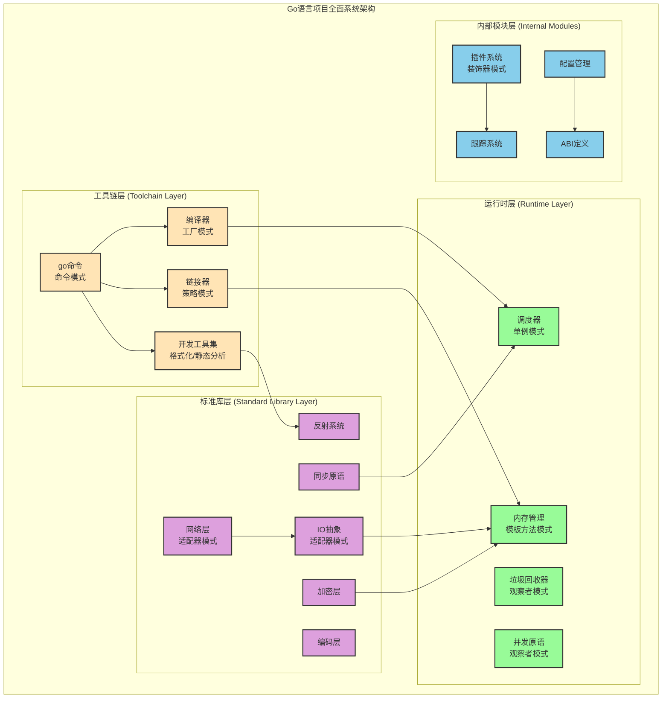
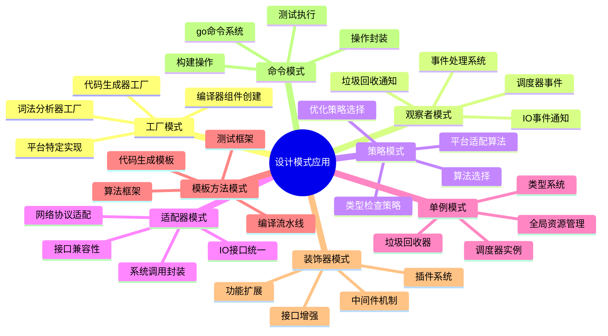
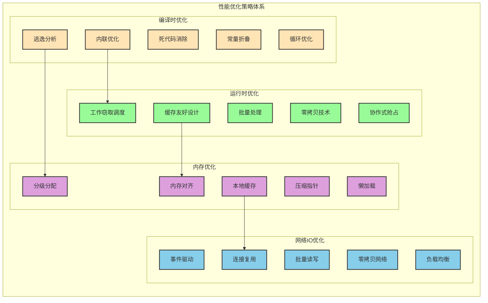
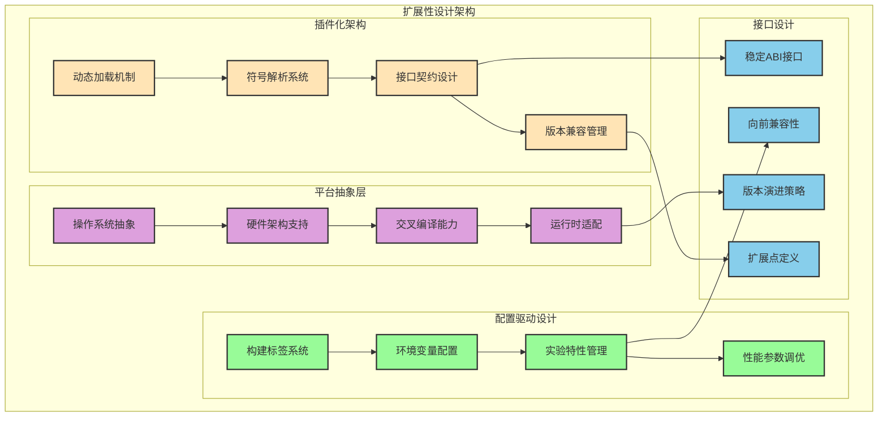

# Go语言项目架构分析总结

## 分析成果概述

本次深入分析Go语言项目源码，成功绘制了一个全面的系统架构图，并提供了详细的技术分析文档。分析覆盖了从底层运行时到上层工具链的完整技术栈。

## 整体架构概览

## 主要交付物

### 1. 全面系统架构图 (`go_comprehensive_architecture.puml`)
- **层次化架构展示**: 清晰展示了工具链层、运行时层、标准库层和内部模块层
- **设计模式标注**: 识别并标注了8种主要设计模式的应用
- **模块关系映射**: 详细展示了各模块间的依赖和交互关系
- **性能优化标注**: 标注了关键的性能优化策略和技术
- **中文注释说明**: 每个模块都有详细的中文功能说明

### 2. 详细技术分析文档 (`go_comprehensive_architecture_analysis.md`)
- **架构层次分析**: 深入解析四层架构的设计理念
- **核心模块识别**: 详细说明各核心模块的职责和实现
- **设计模式应用**: 分析8种设计模式在Go项目中的具体应用
- **架构决策说明**: 解释关键架构决策的权衡考虑
- **扩展性设计**: 分析插件化架构和配置驱动设计
- **性能优化策略**: 详述编译时和运行时的优化技术

## 架构分析亮点

### 设计模式识别
成功识别并分析了以下设计模式的应用：

1. **工厂模式**: 编译器组件的创建和管理
2. **观察者模式**: 事件处理和通知系统
3. **策略模式**: 算法选择和平台适配
4. **适配器模式**: 接口兼容性和系统集成
5. **单例模式**: 全局资源管理
6. **模板方法模式**: 代码生成和算法框架
7. **装饰器模式**: 功能扩展和增强
8. **命令模式**: 工具链和操作封装

### 架构决策分析
深入分析了Go语言的关键架构决策：

```mermaid
graph LR
    subgraph "关键架构决策权衡"
        subgraph "编译时 vs 运行时"
            A1[静态编译<br/>性能优势]
            A2[运行时反射<br/>灵活性]
            A3[接口动态分发<br/>平衡点]
        end

        subgraph "内存管理策略"
            B1[垃圾回收<br/>自动管理]
            B2[手动优化<br/>性能控制]
            B3[并发回收<br/>低延迟]
        end

        subgraph "并发模型"
            C1[CSP模型<br/>简化编程]
            C2[共享内存<br/>性能关键]
            C3[Channel通信<br/>避免竞态]
        end

        subgraph "类型系统"
            D1[静态类型<br/>编译检查]
            D2[接口多态<br/>运行时灵活]
            D3[结构化类型<br/>简化实现]
        end
    end

    A1 -.权衡.-> A2
    A2 --> A3
    A1 --> A3

    B1 -.权衡.-> B2
    B1 --> B3
    B2 --> B3

    C1 -.权衡.-> C2
    C1 --> C3
    C2 --> C3

    D1 -.权衡.-> D2
    D1 --> D3
    D2 --> D3

    classDef decision fill:#FFE4B5,stroke:#333,stroke-width:2px
    classDef balance fill:#98FB98,stroke:#333,stroke-width:2px

    class A1,A2,B1,B2,C1,C2,D1,D2 decision
    class A3,B3,C3,D3 balance
```

- **编译时优化 vs 运行时灵活性**: 静态编译+运行时反射的平衡
- **内存管理策略**: 垃圾回收+手动优化的结合
- **并发模型选择**: CSP模型+共享内存的混合方案
- **类型系统设计**: 静态类型+接口多态的组合

### 性能优化策略
全面梳理了Go语言的性能优化技术：

#### 编译时优化
- 内联优化、逃逸分析、死代码消除
- 常量折叠、循环优化

#### 运行时优化
- 工作窃取调度、批量处理
- 缓存友好设计、零拷贝技术

#### 内存优化
- 分级分配、本地缓存
- 压缩指针、内存对齐

#### 网络IO优化
- 事件驱动、连接复用
- 批量读写、零拷贝网络

## 技术价值与应用

### 1. 学习价值
- **系统设计参考**: 为大型系统设计提供最佳实践参考
- **设计模式应用**: 展示设计模式在实际项目中的应用
- **性能优化指导**: 提供系统性能优化的思路和方法
- **架构决策参考**: 为技术选型提供决策依据

### 2. 实践指导
- **代码架构设计**: 指导如何设计可扩展的代码架构
- **模块化设计**: 展示如何进行有效的模块划分
- **接口设计**: 提供接口设计的最佳实践
- **并发编程**: 指导并发系统的设计和实现

### 3. 技术洞察
- **编译器设计**: 深入理解现代编译器的架构
- **运行时系统**: 了解高性能运行时的设计原理
- **内存管理**: 掌握现代垃圾回收器的实现技术
- **并发调度**: 理解高效调度器的设计思想

## 扩展性分析

### 插件化架构
- **动态加载机制**: 支持运行时功能扩展
- **符号解析系统**: 实现插件的动态链接
- **接口契约设计**: 保证插件系统的稳定性
- **版本兼容管理**: 处理插件版本演进

### 配置驱动设计
- **构建标签系统**: 支持条件编译
- **环境变量配置**: 运行时行为调整
- **实验特性管理**: 渐进式特性启用
- **性能参数调优**: 运行时优化配置

### 平台抽象层
- **操作系统抽象**: 跨平台兼容性
- **硬件架构支持**: 多架构适配
- **交叉编译能力**: 目标平台灵活性
- **运行时适配**: 平台特定优化

## 应用建议

### 对于系统架构师
1. **参考分层架构设计**: 采用清晰的分层架构
2. **应用设计模式**: 合理使用设计模式解决架构问题
3. **关注性能优化**: 在设计阶段考虑性能优化策略
4. **设计扩展机制**: 预留系统扩展和演进空间

### 对于开发团队
1. **模块化开发**: 按照清晰的模块边界进行开发
2. **接口优先设计**: 重视接口设计和契约定义
3. **并发编程实践**: 学习Go的并发编程模式
4. **性能意识培养**: 在开发过程中关注性能影响

### 对于技术决策
1. **技术选型参考**: 参考Go的技术选型思路
2. **架构演进策略**: 学习Go的渐进式演进方法
3. **性能优化策略**: 采用系统性的性能优化方法
4. **扩展性规划**: 提前规划系统的扩展性需求

## 结论

通过对Go语言项目的深入架构分析，我们不仅理解了一个成功的编程语言生态系统的设计原理，更重要的是获得了可以应用于其他大型系统设计的宝贵经验。这个架构分析为我们提供了：

1. **完整的架构视图**: 从宏观到微观的全面理解
2. **设计模式实践**: 真实项目中的模式应用案例
3. **性能优化指南**: 系统性的优化策略和技术
4. **扩展性设计**: 面向未来的架构设计思路

这些分析成果不仅有助于深入理解Go语言本身，更为我们设计和构建高质量的软件系统提供了重要的参考和指导。
