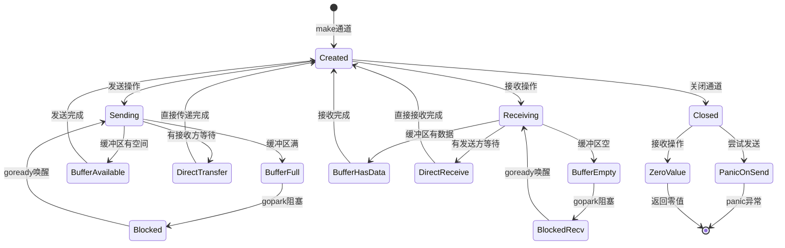

# Go Channel 实现原理详解

## 概述

Go 语言的 channel 是实现 goroutine 间通信的核心机制，遵循 "Don't communicate by sharing memory; share memory by communicating" 的设计哲学。本文档详细分析了 Go channel 的底层实现原理。

## 核心数据结构

### hchan 结构体

```go
type hchan struct {
    qcount   uint           // 队列中的数据总数
    dataqsiz uint           // 循环队列的大小
    buf      unsafe.Pointer // 指向大小为 dataqsiz 的数组
    elemsize uint16         // 元素大小
    closed   uint32         // 关闭标志
    timer    *timer         // 定时器通道使用
    elemtype *_type         // 元素类型
    sendx    uint           // 发送索引
    recvx    uint           // 接收索引
    recvq    waitq          // 接收等待队列
    sendq    waitq          // 发送等待队列
    lock     mutex          // 保护所有字段的互斥锁
}
```

### waitq 等待队列

```go
type waitq struct {
    first *sudog  // 队列头
    last  *sudog  // 队列尾
}
```

### sudog 结构体

```go
type sudog struct {
    g          *g            // 等待的 goroutine
    next       *sudog        // 下一个节点
    prev       *sudog        // 前一个节点
    elem       unsafe.Pointer // 数据元素指针
    c          *hchan        // 关联的 channel
    success    bool          // 操作是否成功
    // ... 其他字段
}
```

## 主要操作流程

### 1. 创建通道 (makechan)


**关键步骤：**
- 根据元素类型和缓冲区大小计算内存需求
- 分配 hchan 结构体和缓冲区内存
- 初始化各个字段，包括互斥锁

### 2. 发送操作 (chansend)

发送操作的执行流程取决于通道的状态：

#### 2.1 有接收方等待
- 直接将数据传递给等待的接收方
- 唤醒接收方 goroutine
- 避免数据拷贝到缓冲区

#### 2.2 缓冲区有空间
- 将数据拷贝到缓冲区
- 更新 sendx 索引和 qcount 计数
- 立即返回

#### 2.3 需要阻塞
- 创建 sudog 结构体
- 将当前 goroutine 加入发送等待队列
- 调用 gopark 阻塞当前 goroutine
- 等待接收方唤醒

### 3. 接收操作 (chanrecv)

接收操作的执行流程：

#### 3.1 有发送方等待
- 直接从等待的发送方接收数据
- 唤醒发送方 goroutine
- 对于有缓冲通道，还需要处理缓冲区数据

#### 3.2 缓冲区有数据
- 从缓冲区读取数据
- 更新 recvx 索引和 qcount 计数
- 立即返回

#### 3.3 需要阻塞
- 创建 sudog 结构体
- 将当前 goroutine 加入接收等待队列
- 调用 gopark 阻塞当前 goroutine
- 等待发送方唤醒

### 4. 关闭通道 (closechan)

关闭通道的处理流程：

1. **检查通道状态**
   - 检查是否为 nil 通道
   - 检查是否已经关闭

2. **设置关闭标志**
   - 将 closed 字段设置为 1

3. **唤醒等待的 goroutine**
   - 唤醒所有等待接收的 goroutine（返回零值）
   - 唤醒所有等待发送的 goroutine（会 panic）

## Goroutine 调度机制

### gopark - 阻塞 goroutine

```go
func gopark(unlockf func(*g, unsafe.Pointer) bool, lock unsafe.Pointer, 
           reason waitReason, traceReason traceBlockReason, traceskip int)
```

**功能：**
- 将当前 goroutine 状态设置为 `_Gwaiting`
- 释放关联的锁
- 调度其他 goroutine 运行

### goready - 唤醒 goroutine

```go
func goready(gp *g, traceskip int)
```

**功能：**
- 将 goroutine 状态从 `_Gwaiting` 改为 `_Grunnable`
- 将 goroutine 放入运行队列
- 尝试唤醒空闲的处理器

## 性能优化要点

### 1. 直接传递优化
- 当发送方和接收方同时就绪时，数据直接传递
- 避免缓冲区的额外拷贝开销

### 2. 批量操作
- select 语句可以同时监听多个 channel
- 使用伪随机顺序避免饥饿

### 3. 内存布局优化
- hchan 和缓冲区可能分配在连续内存中
- 减少内存碎片和缓存未命中

## 常见陷阱和注意事项

### 1. 向已关闭的通道发送数据
```go
// 会导致 panic: send on closed channel
close(ch)
ch <- value  // panic!
```

### 2. 关闭已关闭的通道
```go
// 会导致 panic: close of closed channel
close(ch)
close(ch)  // panic!
```

### 3. 关闭 nil 通道
```go
// 会导致 panic: close of nil channel
var ch chan int
close(ch)  // panic!
```

### 4. 从已关闭的通道接收
```go
// 不会 panic，但会返回零值和 false
close(ch)
value, ok := <-ch  // value 为零值，ok 为 false
```

## 时序图说明

配套的 PlantUML 时序图 (`go_channel_sequence.puml`) 详细展示了：

1. **通道创建过程** - makechan 函数的执行流程
2. **发送操作** - 包括直接传递、缓冲区写入、阻塞等情况
3. **接收操作** - 包括直接接收、缓冲区读取、阻塞等情况
4. **通道关闭** - closechan 函数的执行流程和 goroutine 唤醒过程

时序图中标注了具体的源码文件和函数名，便于深入理解实现细节。

## Channel 状态转换图



## Goroutine 状态转换


## 参考资料

- Go 源码：`src/runtime/chan.go`
- Go 源码：`src/runtime/proc.go`
- Go 源码：`src/runtime/select.go`
